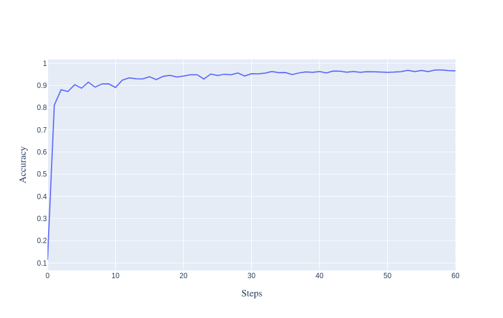
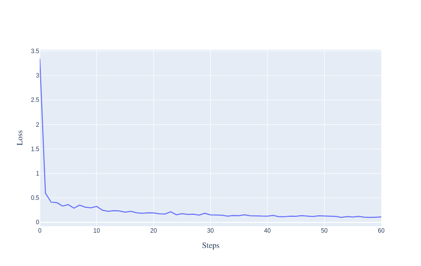

# KANX: Fast Implementation (Approximation) of Kolmogorov-Arnold Network in JAX

Work in progress

## Introduction

Fast Kolmogorov-Arnold Network in JAX based on [`fast-kan`](https://github.com/ZiyaoLi/fast-kan) using [`equinox`](https://github.com/patrick-kidger/equinox).

The original implementation of KAN is [`pykan`](https://github.com/KindXiaoming/pykan).

## Installation
```bash
pip install -r requirements.txt
```

## Example

KANX comes with an example on MNIST:

```bash
python examples/train_mnist.py
```

## Benchmark

More experiments in the future.

| Architecture    | Wall time (sec)|
| -------- | ------- |
| CPU (i5-1135G7)  | 300.11   |
| CPU (i9-12900K) | 187.22     |
| GPU (RTX 3070 Ti)    | 46.85    |

Plots from the GPU experiment:



